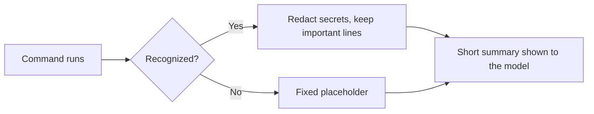

# Command-Output Reducers

For canonical ownership and maintainer evidence, see the [Source Map](/project-wiki/hydra-framework/reference/source-map.md#maintainer-evidence).

When an agent runs a terminal command, the raw output can be long, noisy, or
carry a secret. For a recognized set of commands, Hydra reduces that output
before the model sees it: secrets are redacted, noise is dropped, and only
the lines that matter (errors, file paths, summary stats) are kept. An
unrecognized command never falls back to raw text; it gets a fixed
placeholder saying nothing matched.

## How a command is recognized

Reducers match on the parsed command, not a raw string. Chained commands
(`&&`, `;`) are split apart so a setup step like `cd src && dotnet build` is
understood as `dotnet build`. A pipe stays one command. Environment prefixes
(`FOO=1 dotnet build`) and wrapper commands like `env` are stripped before
matching.

## Redaction and line selection are shared

Every reducer calls the same shared redaction and line-selection policy
rather than writing its own. It redacts anything that looks like a password,
token, API key, or auth header from both the command and its output, drops
blank lines and routine build/install chatter, and keeps error lines, stack
traces, file references, and test failures (with a little context around
them), capped to a line limit. A reducer only declares which command shape
it covers; the redaction and selection behavior is identical for all of
them.

## Adding a new reducer

Reducers are registered explicitly, grouped by tool (curl, Docker, dotnet,
git, npm, ripgrep, yarn). There is no auto-discovery: a new reducer declares
what it matches and calls the shared selection helpers, added once to its
group's registry. Leave every other command on the unknown-command path
rather than adding a catch-all. See
[Extension Points](/project-wiki/hydra-framework/extending-hydra/extension-points.md)
and [Safe Extension Recipes](/project-wiki/hydra-framework/extending-hydra/extension-recipes.md)
for the edit sequence and required tests, then run
`python3 .hydra-framework/scripts/hydra.py validate` and `git diff --check`.

## Security guarantees

The model only sees output that looks close to raw when a reducer matched
the command *and* found something worth keeping; every other outcome (no
match, or a match with nothing important) is a fixed placeholder. A full
unredacted log is only written to disk when explicitly enabled, and only to
the private, untracked `.hydra-framework.local/logs/` tier; the model is told
the log's path, never its contents. Telemetry records only structural
counters (command family, line counts, exit code), never the command text,
its output, or the lines that were kept.

## Worked example

`git status` is matched by its own small reducer, which does nothing but
declare the match and defer to the shared selection logic. The result keeps
changed-file paths and a summary line, drops blank lines, and renders as a
short header (command, family, one-line summary) followed by the kept lines.
