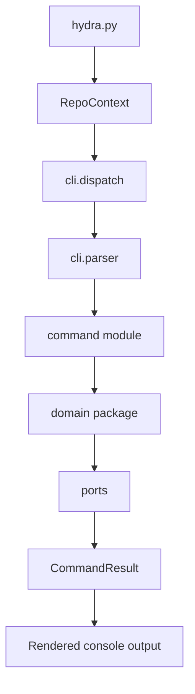

# Engine

For canonical ownership and maintainer evidence, see the [Source Map](/project-wiki/hydra-framework/reference/source-map.md#maintainer-evidence).

The Hydra engine is the executable layer behind the stable
`python3 .hydra-framework/scripts/hydra.py ...` entrypoint. The script is a
compatibility shim: it derives the repository root, loads the framework
context, and dispatches into `hydra_engine`.

The engine turns framework rules into deterministic commands, parsers,
domain services, validation checks, and provider-facing helpers. It does not
own the rules themselves. Stable rules live in `core/`, repository facts live
in `repo/knowledge/`, reusable procedures live in `capabilities/`, and
generated or private state follows the placement rules.

## Runtime shape

The engine follows a small composition path:

`RepoContext` binds one repository root to area-specific paths and parsed
metadata. The dispatch composition root registers command modules and the
direct validation commands. The parser builds the CLI from those registrations.
Command modules coordinate one command family and return `CommandResult`;
domain packages own the underlying object, knowledge, work, provider, intake,
wiki, seed, installation, or hook behavior. Ports isolate filesystem, Git,
clock, and identifier concerns.

The engine's execution stack is the concrete runtime behind Hydra's
[conceptual execution stack](/project-wiki/hydra-framework/architecture/execution-stack.md): the CLI and domain packages
operate inside the Execution Harness, while validation and tests provide the
feedback boundary. The lifecycle that frames one work cycle is described in
[Execution Flow](/project-wiki/hydra-framework/architecture/execution-flow.md) and `core/lifecycle.md`.

## Ownership boundaries

- `scripts/hydra.py` is the stable caller-facing entrypoint, not the normal
  home for new behavior.
- `cli/` owns parser construction, command registration, dispatch, metadata,
  and the route-prompt boundary.
- `commands/` owns command-family coordination and console-facing command
  results. The domain packages it calls own reusable behavior.
- `checks/` owns validation composition and findings. `validate` and `doctor`
  use the validator registry; they do not duplicate check logic in the shim.
- `engine/tests/unit/` mirrors source modules. Repository tests check live-tree
  assumptions, and contract goldens pin stable command output.
- Provider wrappers are generated adapter output. Their canonical sources and
  supported engine registries are documented in [Extension Points](/project-wiki/hydra-framework/extending-hydra/extension-points.md).
- Human-facing wiki pages explain and route to these owners. They are not a
  second source of truth.

The engine uses explicit, reviewable registries for supported extension
boundaries. See [Extension Points](/project-wiki/hydra-framework/extending-hydra/extension-points.md) for
the registry locations and their tests; this page does not repeat that guide.

## Domain layout

The engine is organized by responsibility rather than by provider or execution
layer:

| Area | Responsibility |
| --- | --- |
| `identity/`, `documents/`, `ports/` | Foundational identity, document parsing, and external boundaries. |
| `objects/` | Object discovery, envelopes, references, registry state, and schema moves. |
| `knowledge/`, `wiki/` | Package routing, context compilation, knowledge checks, and wiki-link validation. |
| `work/`, `providers/`, `intake/` | Task state, adapter planning, provider classification, and staged material flows. |
| `seed/`, `installation/`, `agent_hooks/` | Seed comparison, adoption, deterministic hook helpers, and private retry or log state. |
| `checks/`, `commands/`, `cli/` | Validation composition, command-family coordination, and top-level dispatch. |

This layout is enforced by architecture checks for module size, import cycles,
layer direction, fan-out, test mirroring, repository-root derivation, and
other boundary constraints. The checker is pure AST analysis, so it can inspect
the engine tree without importing the engine as a whole.

## Reading the engine

Use the [command surface](/project-wiki/hydra-framework/reference/command-surface.md) for an operator or
maintainer lookup. Use the owning source module and its tests when a behavior
claim needs verification. The main routes are:

1. Start with `cli/dispatch.py` and `cli/parser.py` to see composition and
   registration.
2. Follow the command family into `commands/`.
3. Follow reusable behavior into its domain package and its mirrored unit
   tests.
4. Check repository tests and contract goldens when the claim concerns the live
   tree or command output.

`validate` is the normal framework-wide structural gate. `validate-wiki` is
the focused gate for human-facing documentation. `selftest` runs the bundled
engine unit, repository, and contract tests through the stable shim.

## Related pages

- [Execution Stack](/project-wiki/hydra-framework/architecture/execution-stack.md) explains the wider runtime model.
- [Extension Points](/project-wiki/hydra-framework/extending-hydra/extension-points.md) lists supported
  registries without duplicating them here.
- [Object And Context Model](/project-wiki/hydra-framework/architecture/object-context-model.md) follows identities and
  context packets across the engine's object and knowledge components.
- [Command Surface](/project-wiki/hydra-framework/reference/command-surface.md) groups commands by
  operator need and links to their owners.
- [Evolution](/project-wiki/hydra-framework/evolution/evolution.md) explains seed comparison, adaptation,
  reflection, and propagation around the engine.
