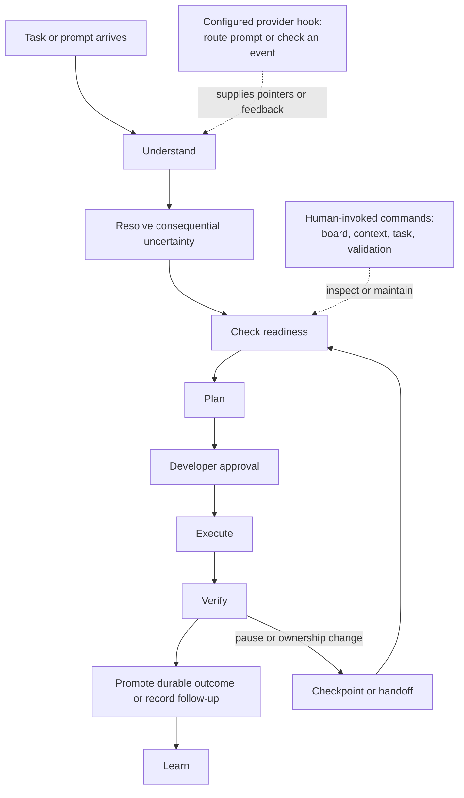

# Execution Flow

One loop moves a task from an understandable request to verified, reusable
outcomes. It is a model for operating Hydra, not a promise that Hydra starts
work or changes repository state on its own.

For canonical ownership and maintainer evidence, see the [Source Map](/project-wiki/hydra-framework/reference/source-map.md#maintainer-evidence).

Readiness gates entry into execution, and verification brackets execution on
the way to learning. A task record is used only when the work is non-trivial,
interrupted, blocked, handed off, or valuable for team visibility. It keeps
readiness, step state, evidence, and continuation facts available without
becoming a transcript. When responsibility changes, hand off the record; when
the work is complete, preserve its durable outcome and complete the task so Git
history remains the archive.

The [Task Lifecycle](/project-wiki/hydra-framework/working-with-hydra/task-lifecycle.md)
page explains record state and handoff. Provider hook boundaries are covered by
[Provider Adapters](/project-wiki/hydra-framework/extending-hydra/provider-adapters.md).

## Activation Boundaries

| Boundary | What happens | What does not follow from it |
| --- | --- | --- |
| Human-invoked | A person or agent deliberately runs `board`, context, task-state, or validation commands and acts on their output. | Hydra does not infer that a task should be created, approved, or completed. |
| Provider hook | A configured provider event can route a prompt, attach pointers, check edits, or reduce command output. Codex hook wiring is local runtime integration, not canonical meaning. | Hooks are not available merely because the repository contains Hydra, and they do not do broad reasoning or silently rewrite canonical state. |
| Automatic deterministic behavior | Once a supported command or configured hook runs, its bounded implementation can produce its defined result, such as checking a package gate or removing a completed task record. | This is not an unattended scheduler or a replacement for review, approval, and validation judgment. |

The [Execution Harness](/project-wiki/hydra-framework/architecture/execution-stack.md) supplies the instructions, tools,
environment, state, and feedback for each loop. The governing sequence lives
in the [Task Lifecycle](/project-wiki/hydra-framework/working-with-hydra/task-lifecycle.md)
page; provider hook boundaries are covered by [Provider Adapters](/project-wiki/hydra-framework/extending-hydra/provider-adapters.md).

For a concrete small change from initial request through completion, follow
[First Task Walkthrough](/project-wiki/hydra-framework/working-with-hydra/first-task.md).
