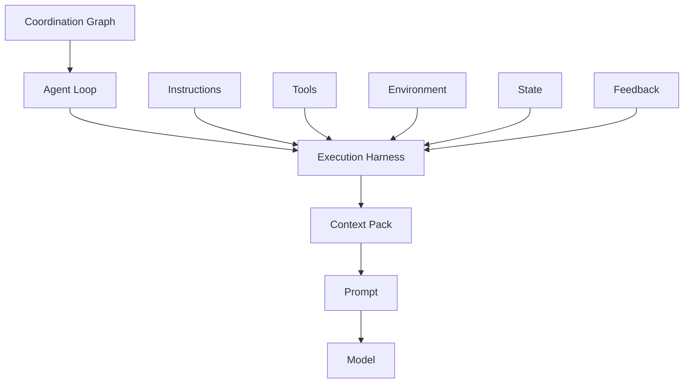

# Execution Stack

Hydra describes runtime responsibilities with this conceptual stack:

`Coordination Graph -> Agent Loop -> Execution Harness -> Context Pack -> Prompt -> Model`

| Layer | Responsibility |
| --- | --- |
| Coordination Graph | Coordinates tasks, agents, dependencies, handoffs, and recovery across loops. |
| Agent Loop | Drives one agent through understanding, readiness, planning, action, verification, and learning. |
| Execution Harness | Supplies instructions, tools, environment, state, and feedback for reliable model work. |
| Context Pack | Selects the canonical state, task facts, constraints, and assumptions the model should see. |
| Prompt | Carries the immediate instruction assembled from the selected context. |
| Model | Provides the provider-neutral reasoning and execution runtime. |

The Execution Harness is composed of five cooperating subsystems: Instructions,
Tools, Environment, State, and Feedback. Together they provide the operating
conditions around the prompt. The prompt is therefore one part of the system,
not the whole reliability mechanism.

This stack is an architecture frame, not a filesystem layout. The repository
uses responsibility-first directories and represents execution layering through
metadata, placement rules, and internal structure. The [Architecture](/project-wiki/hydra-framework/architecture/architecture.md)
page provides the reader route; exact owners are listed in the [Source Map](/project-wiki/hydra-framework/reference/source-map.md#maintainer-evidence).

Continue to [Execution Flow](/project-wiki/hydra-framework/architecture/execution-flow.md) for the sequence of one work
cycle, or return to [Architecture](/project-wiki/hydra-framework/architecture/architecture.md).
