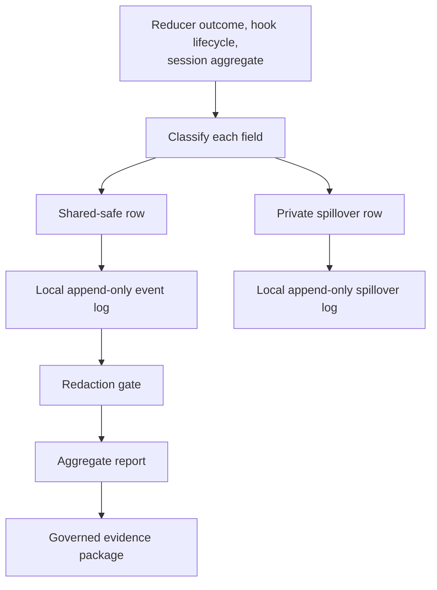

# Telemetry Pipeline

For canonical ownership and maintainer evidence, see the [Source Map](/project-wiki/hydra-framework/reference/source-map.md#maintainer-evidence).

Hydra measures its own runtime by capturing structural events locally, then
lets a governed, reviewed slice of that private corpus reach shared state as
derived evidence. This page explains the pipeline mechanics. For the
governance boundary between review evidence and telemetry, and for the
deferred provider-traffic caveat, see
[Evidence and Telemetry](/project-wiki/hydra-framework/operations/evidence-and-telemetry.md).

## Capture at the source

Three kinds of call site build a provider-neutral event payload and hand it
to the telemetry writer:

- **Command-output reducers** record a `command_output.reducer_outcome`
  event after reducing a Bash tool's output: which command family matched,
  whether a reducer was found, and line/character counts, never the command
  text or its output.
- **Hook lifecycle** commands record `command.invocation` and
  `knowledge.command_usage` / `knowledge.route` events as a provider hook
  runs a Hydra command or resolves a knowledge route.
- **Session aggregates** are built from a provider's transcript at hook time:
  turns, token totals, and model name are summed across the transcript's
  usage rows and written as one `session.aggregate` event. The transcript
  itself is read only to sum these fields; transcript paths and raw rows are
  never event fields. Provider-specific usage keys are mapped to canonical
  names before capture, for example Claude's `cache_read_input_tokens` and
  Codex's `cached_input_tokens` both become `cache_read_tokens`.

Every capture site converges on one writer, so the classification and
redaction step below runs identically regardless of where an event
originated.

## Classification and redaction

Before a payload is written anywhere, every field name in it is looked up
against a closed classification: captured verbatim, hashed, stripped,
aggregated only, private-spillover only, or dropped entirely. The full field
list and the poison rule for nominally structural fields are the
[Telemetry Redaction Contract](/.hydra-framework/repo/knowledge/telemetry-redaction-contract.md).

A field classified as hashed (`session_id`, `agent_id`) is stored under a
hash-suffixed key such as `session_id_hash`, salted with a private
per-repository salt, so a shared row can never carry a raw provider
identifier. A field classified as captured verbatim still fails closed to
private spillover if its actual value looks like a credential, absolute
path, email, or other unsafe content: classification says a field is
allowed to be shared, not that any value it happens to hold is safe.

## Local, private, append-only storage

Redaction splits one payload into two rows, each appended to its own
JSONL file under the private, untracked `.hydra-framework.local/telemetry/`
tier: a shared-safe row in the events log, and any failed-closed fields in
a separate spillover log. Both logs are append-only and local only, forever;
nothing here is pushed or synced automatically. An advisory line count keeps
the events log from growing unnoticed; deleting the file resets local
telemetry.

## The redaction gate

`hydra.py telemetry gate` is the release gate that must pass before shared
telemetry defaults can change. It runs the redaction step against a fixed
set of synthetic event fixtures plus every row already captured locally,
then poisons each field of each row in turn (substituting a fixture string
that looks like a credential) and checks that the poisoned field always
spills to private storage. A gate run also checks that every field name seen
is classified, and that the spillover rate and event/kind counts clear
minimum thresholds. The result is a JSON attestation: verdict, event and
field-name counts, and a digest of the redaction module itself, so a package
built against an older redaction contract can be told apart from one built
against the current one.

The same poisoned-fixture strategy backs the executable test suite that
proves the contract, covering credentials, emails, customer-shaped fields,
absolute paths, prompt text, transcript rows, command output, private file
markers, unknown fields, raw record arrays, and dashboard artifacts.

## Aggregate report

`hydra.py telemetry report --json` reads the local events log and emits only
derived aggregates: total event count, distinct event kinds and field names,
per-kind counts, knowledge command and route counts, and reducer coverage.
This is the one supported way to get numbers out of the private corpus
without hand-reading the events log, and it is the only shape a telemetry
evidence package's `metrics.json` is allowed to hold: scalars, per-kind count
maps, and name lists, never a raw row.

## Evidence-package lifecycle

`hydra.py telemetry evidence create --slug <slug> --question "<question>"`
mints a package under `.hydra-framework/repo/telemetry/packages/` from a real
gate run: an enveloped `overview.md`, a `metrics.json` built from the
aggregate report, and a verbatim `gate-attestation.json`. It refuses to run
when the gate verdict is `fail`, and it leaves `## Question`, `## Findings`,
and `## Method` as `TODO` for a person or agent to fill in with a reviewed
explanation.

Placement rules give this queue the same shape as the reflections and
candidates queues: bounded, author-attributed, one enveloped object per
package, with a closed status vocabulary (`open`, `absorbed`, `superseded`,
`rejected`) and only `open` packages exerting drain pressure. Unlike
reflections, a terminal package is never deleted; it stays in `packages/` as
the durable record of a measurement already made. See
[placement rules](/.hydra-framework/core/placement-rules.md) and the
[telemetry package contract](/.hydra-framework/repo/telemetry/README.md) for
the full directory and status contract, and
`capabilities/skills/telemetry-evidence-absorb/` for how an `open` package is
reviewed and drained.
