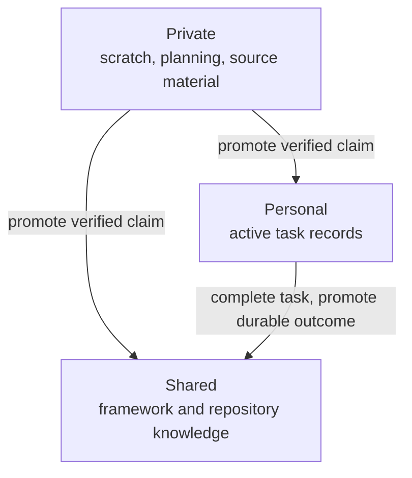

# State Tiers

Hydra places state by what it describes, not merely by whether it is safe to
version. The complete boundary and its repository companion are recorded for
maintainers in the [Source Map](/project-wiki/hydra-framework/reference/source-map.md#maintainer-evidence).

| Tier | Use it for | Location | Git |
| --- | --- | --- | --- |
| Shared | Facts and rules that describe the repository | `.hydra-framework/` | Tracked and review-gated |
| Personal | Structured work another person may need to inherit | `.hydra-framework/tasks/personal/<owner>/` | Tracked and owner-scoped |
| Private | Personal thinking, scratch, source material, and machine-local state | `.hydra-framework.local/` | Ignored |

The shared tier owns durable framework and repository knowledge. The personal
tier owns active task records and checkpoints. The private tier is for work
that is not meant to become permanent, including planning and half-formed
ideas. A finished personal task is removed from the active set; Git history
holds its archive. See [Task Lifecycle](/project-wiki/hydra-framework/working-with-hydra/task-lifecycle.md) for the task
record mechanics.

The boundary rule is simple: a shared file may never cite a private file. When
private material becomes durable, promote the verified claim into its proper
shared or personal owner rather than linking to the private source. The [Source Map](/project-wiki/hydra-framework/reference/source-map.md#maintainer-evidence)
records the complete contract for maintainers.

Return to [Concepts](/project-wiki/hydra-framework/concepts/concepts.md), or continue to
[Architecture](/project-wiki/hydra-framework/architecture/architecture.md) if you need the runtime model
that reads and writes this state.
