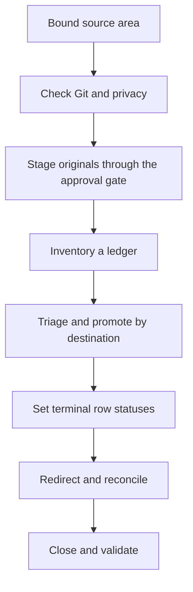

# Migrate A Bounded Source Area

For canonical ownership and maintainer evidence, see the [Source Map](/project-wiki/hydra-framework/reference/source-map.md#maintainer-evidence).

Page type: operating guide

Use migration when the job is to clear a bounded source area and account for
everything in it. Examples include an inherited wiki, transferred docs folder,
old prompt library, or legacy agentic setup. Use [ordinary intake](/project-wiki/hydra-framework/extending-hydra/intake.md)
for one source.

## Migration Flow



## Stage Before Promoting

Bound the roots and count them before reading contents. Check who owns their
history and route the reversible staging move accordingly:

```bash
git ls-files <root> | wc -l
git check-ignore -v <root>
```

| Source state | Staging route |
| --- | --- |
| Already shared and tracked by Git | Tracked `.migrations/<source-slug>/` |
| Ignored, private, sensitive, or never committed | `.hydra-framework.local/migrations/<slug>/originals/` |

Request and approve the bounded staging action before moving anything or
promoting a claim. Move originals rather than copying them, so the source area
has one clear authority and the move remains reversible. The material
migration workflow
owns the request, approval, and staging details.

## Drain The Ledger

Create one migration workspace under
`.hydra-framework/intake/migrations/<YYYY-MM-DD>-<slug>/` and inventory the
staged area into its ledger. Triage rows by destination, then promote related
meaning in batches. Terminal statuses are `promoted`, `kept-private`,
`rejected`, and `redirected`; a `deferred` row needs a follow-up owner before
it is terminal.

Do not measure completion by the number of promotions. The migration is ready
to close only when no row is pending, every item has a terminal outcome, and
the workspace records the final reconciliation. Leave one redirect at each
drained source root where readers may still look.

## Take Over Legacy Agentic Material

Takeover is an explicit migration path for an existing non-Hydra or legacy
agentic setup. First classify candidate roots such as `.claude/`, `.codex/`,
`.agents/`, Cursor, Windsurf, Copilot, prompt libraries, or old agent files.
Generated Hydra adapters remain adapters, not canonical sources. Confirm the
roots and scope with the owner, then use the migration workflow to stage,
triage, promote, redirect, and close them.

Adoption is separate: [Seed And Adopt Hydra](/project-wiki/hydra-framework/start-here/adopt-a-repository.md)
leaves existing repository material in place. Do not start takeover as part of
adoption.

## Related Routes

[Process One Source Through Intake](/project-wiki/hydra-framework/extending-hydra/intake.md) is the smaller per-source path.
[Seed And Adopt Hydra](/project-wiki/hydra-framework/start-here/adopt-a-repository.md) is the
non-destructive new-repository path. Use [Validation](/project-wiki/hydra-framework/operations/validation.md)
for the final evidence gate.
