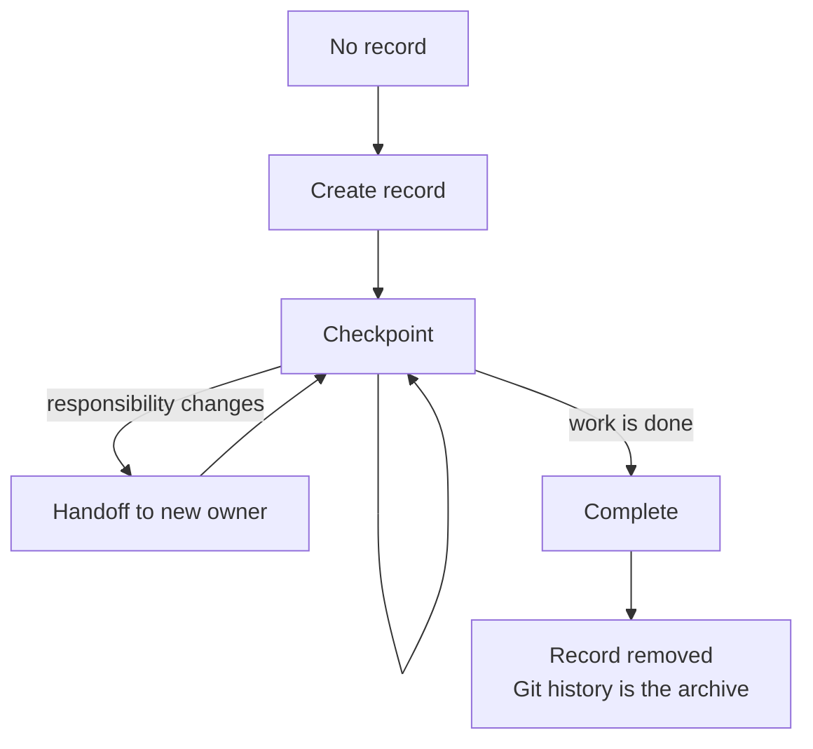

# Task Lifecycle

For canonical ownership and maintainer evidence, see the [Source Map](/project-wiki/hydra-framework/reference/source-map.md#maintainer-evidence).

Status: orientation page

Task records are tracked continuation state for work whose loss would cost the
next agent or teammate real effort. They make non-trivial work resumable
without turning raw conversation history into repository memory.

## The Lifecycle

1. Decide whether the work meets the workflow's persistence triggers. Small,
   self-contained work does not need a formal record.
2. For persisted work, use the existing owner-scoped record when one covers
   the objective. The board shows active records. Read anyone's record, but
   edit only your own.
3. Check readiness before execution, then maintain the record's step state,
   changed files, validation evidence, and continuation notes as the work
   progresses. The workflow, template, and validator own the exact record
   contract.
4. Checkpoint when work pauses, a blocker appears, context is low, or a
   handoff is likely. Use handoff when responsibility changes so the record
   and matching checkpoints move together.
5. When the work is complete, promote durable outcomes to their canonical
   owners, then complete the task. Completion removes the record because Git
   history is its archive.

The command-shaped procedure is maintained by the task state skill.
The exact field contract belongs to the task lifecycle workflow,
not this overview page.



## Useful Commands

```bash
python3 .hydra-framework/scripts/hydra.py board
python3 .hydra-framework/scripts/hydra.py task checkpoint <name-or-path>
python3 .hydra-framework/scripts/hydra.py task handoff <name-or-path> --to <owner>
python3 .hydra-framework/scripts/hydra.py task complete <name-or-path> --outcome <path|none>
```

Run `python3 .hydra-framework/scripts/hydra.py validate` to check active task
records and the wider Hydra contracts. Validation catches missing required
labels and owner-directory disagreement; judgment about whether a checkpoint
is useful or whether completed steps contain meaningful evidence remains with
the author. The [Source Map](/project-wiki/hydra-framework/reference/source-map.md#maintainer-evidence)
lists the task validation owner.
